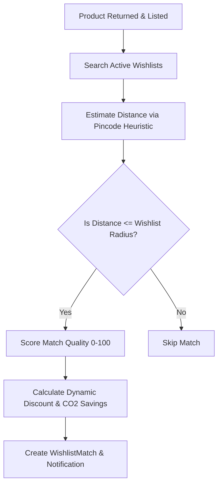

# FluxForge — Implemented Features Document
**Amazon HackOn Season 6.0 | Circular Intelligence & Green Credits Platform**

FluxForge — internally branded the **"Amazon Green Credits Ecosystem"** — is a circular-commerce and sustainability platform built on top of Amazon retail infrastructure. It redefines the product returns pipeline by converting returned items into circular commerce opportunities (refurbishment, resale, donation, recycling) and rewards customers for sustainable behaviors.

Below is the complete, comprehensive documentation of all features implemented in the codebase.

---

## 1. Core Architecture & User Roles

FluxForge operates on a monorepo setup consisting of a **FastAPI backend** and a **React 19 + Vite frontend**, using **SQLite** in development and **PostgreSQL** in production. The system defines three specific user roles based on the `User.role` database field:

*   **Customer (`customer`):** The primary user who shops, initiates returns, earns and redeems Green Credits, lists items in the community resale marketplace, manages a sustainability wishlist, and utilizes virtual apparel try-on.
*   **Employee (`employee`):** Warehouse operators or delivery agents responsible for performing the delivery baseline scan of orders and working designated delivery zones.
*   **Admin (`admin`):** System administrators who access the platform-wide Analytics Dashboard to monitor system health, return rates, cost savings, and environmental metrics.

---

## 2. Simplified One-Click Returns & Backend AI Fallback

FluxForge uses a simplified, user-friendly **One-Click Return** system directly from the customer's Orders page (`Orders.jsx`). This replaces complex multi-phase scan requirements for a smoother user experience, while preserving downstream circular-commerce mechanics through a backend AI condition assessment fallback.

### Key Return Flow Mechanics:
1. **One-Click Return Submission:** A customer initiates a return directly via a button on the order list (`Orders.jsx`). The order's status is immediately updated to `returned`, and any pending loyalty Green Credits for keeping the item are forfeited.
2. **Backend AI Assessment Fallback (`/api/returns/`):** When a return is created, the backend returns router (`returns.py`) executes an assessment calculation:
    *   If no custom assessment data is provided (the default customer flow), the router applies a high-fidelity **AI Assessment fallback**: `recommended_action` is set to `resell`, `condition_score` to `90`, `remaining_life_pct` to `95`, and `defects` to `"Light retail packaging wear, product pristine."`
    *   If custom assessment parameters are supplied, the router persists them accordingly.
    *   Status is directly set to `completed` and the order is marked `returned`.
3. **Automatic Second-Life Catalog Listing:** Returned items processed with a recommendation of `resell` or `refurbish` automatically spawn a new available `Listing` in the Second-Life marketplace, making it instantly discoverable and purchaseable by other users.
4. **Green Credits Award:** The return API calculates and immediately awards sustainability credits to the user's account balance based on the circular outcome (e.g., reselling).

---

## 3. NearDrop Proximity-Based Wishlist Matching

When a returned item is listed for resale or refurbishment, the matching engine bypasses long-distance shipping by routing it directly to a local buyer.

### Key Mechanics:
1. **Pincode Proximity Heuristic:** Since exact coordinates are omitted for user privacy, distance is estimated using Indian pincodes:
    *   Same pincode: 1.0 km
    *   Same first 5 digits: 3.0 km
    *   Same first 4 digits: 5.0 km
    *   Same first 3 digits: 10.0 km
    *   Same first 2 digits: 30.0 km
    *   Same first digit: 100.0 km
    *   Different: 250.0 km
2. **Composite Scoring (0-100):** Matches are scored using weights:
    $$\text{Match Score} = \text{Product Match (30)} + \text{Price Fit (25)} + \text{Distance Bonus (20)} + \text{Condition (15)} + \text{Brand Prefs (10)}$$
3. **Dynamic Logistics Discounts:** Calculated using categories and saved delivery miles:
    $$\text{Discount} = \text{Base Category Discount} + \text{40% of Logistics Savings} + \text{Urgency Bonus (up to 5% for old entries)}$$
    *   *Note: Total discounts are clamped between 15% and 50% of the original price.*
4. **Impact:** Avoids typical 150 km return-to-warehouse loops, saving an average of **17 kg CO₂** per transaction.

---

## 4. Green Credits Sustainability Reward System

A gamified economy motivates circular choices by rewarding sustainable behavior with in-app Green Credits.

### Credit Formula
$$\text{Credits Earned} = \text{Base Action Credits} \times \text{Product Impact Score} \times \text{Sustainability Multiplier}$$

*   **Base Action Credits:** Donate (100), Resell (80), Refurbish (60), Repair (50), Purchase Refurbished (50), Eco-Consolidated Delivery (15), Recycle (30).
*   **Product Impact Scores:** Electronics (2.5x), Running (1.2x), Fitness (1.0x), Yoga (0.8x).
*   **Sustainability Multipliers:** Eco Delivery (1.5x), Standard (1.0x), Express (0.5x).

### User Levels
Based on lifetime earned credits, users progress through five levels:
1.  **Seed:** 0 - 100 credits
2.  **Sapling:** 101 - 300 credits
3.  **Green Hero:** 301 - 700 credits
4.  **Planet Protector:** 701 - 1500 credits
5.  **Circular Champion:** 1501+ credits

### Additional Features:
*   **No-Return Loyalty Vesting (`/api/orders/{id}/vest-credits`):** Earned credits for keeping a product (no return) remain pending and vest only when the product's return window expires.
*   **Redemption Store (`/api/redemptions/redeem`):** Credits can be spent on shopping discounts, Amazon Prime extensions, tree-planting initiatives, or recycling charity donations.
*   **Green Challenges:** Users complete time-limited challenges (e.g., *"Keep your phone for 12 more months"* or *"Choose eco-delivery 3 times"*) to win bonus credits.

---

## 5. Community Resale Marketplace

A peer-to-peer circular resale channel where customers can buy and sell items locally.

*   **AI Price Suggestion (`/api/community/price-suggest`):** Uses Bedrock Nova Lite to suggest an optimal listing price and provides detailed reasoning based on the item's brand, condition, and category.
*   **Geographic Alerts (`/api/community/alerts`):** Users subscribe to alerts (by category and pincode) to receive in-app notifications the moment a matching local listing is uploaded.
*   **Seller Trust Score:** Computed upon successful transactions to build marketplace trust.
*   **Leaderboard:** Displays top sustainable users ranked by lifetime environmental savings (CO₂ saved, e-waste prevented).

---

## 6. Virtual Apparel Try-On (VTON)

Enables pre-purchase try-on of apparel items to eliminate sizing/fit returns.

*   **Photo Management (`/api/tryon/upload-photo`):** Allows users to upload body/selfie photos stored securely in S3.
*   **IDM-VTON Generation (`/api/tryon/generate`):** Connects to the `yisol/IDM-VTON` Hugging Face Gradio client. It generates a blended photo overlaying the selected garment onto the user's uploaded body photo.
*   **TryOnCache:** Results are cached by the user-product-photo key to prevent redundant, expensive GPU client calls.

---

## 7. Purchase Confidence Card & Eco-Delivery

Surfaced directly on the product detail page to help buyers make informed decisions.

*   **Confidence Scores:** Displays a *Return Frequency Score* (rate of product returns for this SKU) and a *Personal Comfort Score* (size/fit heuristic based on the user's profile preferences).
*   **Environmental Footprint Card:** Details the exact CO₂ footprint (kg), e-waste potential (kg), and water consumption (liters) of the item.
*   **Refurbished Alternative:** Recommends certified pre-owned versions of the item if available in the Second-Life feed.
*   **AI Care Advisor:** Bedrock-generated tips for product care to maximize lifespan.
*   **Eco-Delivery Selection:** Customers select delivery methods at checkout:
    *   *Express:* 1 Day | 3.4 kg CO₂ | 0 Credits
    *   *Standard:* 3 Days | 1.2 kg CO₂ | ~15 Credits
    *   *Eco-Consolidated:* 5 Days | 0.0 kg CO₂ | ~22 Credits

---

## 8. Admin Analytics Dashboard

A comprehensive dashboard for platform administrators featuring live data queries.

*   **KPI Metrics:** Real-time stats on return rates (compared to the 20% retail baseline), AI inspection accuracy, eco-delivery adoption, total products resold, CO₂ saved, and platform financial recovery (in INR).
*   **Breakdowns:** Categorized views of return reasons, regional return hot-spots, and monthly trends.
*   **Top Returns:** Tabular list of the top 5 most frequently returned products.

---

## 9. Database Schema Mapping (16 Tables)

The circular commerce logic is supported by a 16-table relational schema:

| Table Name | Description | Key Fields |
| :--- | :--- | :--- |
| `users` | Accounts, roles, locations, wallet balances, and carbon saving logs. | `id`, `green_credits`, `lifetime_credits`, `role`, `pincode` |
| `products` | E-commerce catalog containing product details and environment impacts. | `id`, `price`, `co2_impact`, `ewaste_impact`, `water_impact`, `has_no_return_policy` |
| `orders` | Completed purchases, delivery types, and baseline scan references. | `id`, `user_id`, `product_id`, `delivery_type`, `baseline_scan_urls` |
| `returns` | Logged returns containing Bedrock AI assessment outcomes. | `id`, `order_id`, `condition_score`, `defects`, `recommended_action` |
| `listings` | Second-Life marketplace catalog created from processed returns. | `id`, `return_id`, `price`, `status` ("available", "sold") |
| `green_credit_tx` | Ledger recording all earned and redeemed green credits. | `id`, `user_id`, `amount`, `action_type`, `type` ("earned", "redeemed") |
| `green_challenges` | Active and completed gamified challenges. | `id`, `user_id`, `title`, `reward_credits`, `status` |
| `redemptions` | Log of spent credits for rewards/coupons. | `id`, `user_id`, `type`, `credits_spent` |
| `wishlists` | Wishlist entries utilized by the NearDrop engine. | `id`, `user_id`, `category`, `brand`, `radius_km`, `max_price` |
| `wishlist_matches` | Matches detected within distance parameters. | `id`, `wishlist_id`, `listing_id`, `match_score`, `discounted_price` |
| `wishlist_notifications`| Notifications triggered for matched wishlists. | `id`, `user_id`, `match_id`, `message` |
| `community_listings` | Peer-to-peer user sales with AI summaries and pricing logic. | `id`, `seller_id`, `asking_price`, `suggested_price`, `ai_price_reasoning` |
| `community_alerts` | P2P subscriptions watching category/location uploads. | `id`, `user_id`, `category`, `pincode` |
| `community_notifications`| P2P alerts notifying matching sellers. | `id`, `user_id`, `listing_id`, `message` |
| `user_body_photos` | User-uploaded body photos (S3 keys) for try-on. | `id`, `user_id`, `image_key` |
| `tryon_cache` | Cached VTON garments and body photo outputs. | `id`, `user_id`, `product_id`, `tryon_result_key` |

---

## 10. Backend Service Directory

The FastAPI service layer encapsulates all business logic, isolated from routing details:

*   `media_validator.py`: Handles validation of image/video assets, ensuring uploads match sizing and quality requirements.
*   `ai_assessment.py`: The integration point for Bedrock/Claude Vision. Computes condition, remaining life, and recommended circular action.
*   `product_verifier.py`: Matches returned products to purchase catalog specifications.
*   `wishlist_matcher.py`: Coordinates the NearDrop radius search, composite scoring, and dynamic logistics discount engine.
*   `credit_engine.py`: Governs Green Credits earnings, user level tiers, eco-delivery points, and vesting.
*   `impact_calculator.py`: Quantifies environmental savings (CO₂, e-waste, water) based on circular outcomes.
*   `sustainability_advisor.py`: Generates custom, Bedrock-driven sustainability recommendations and Care Cards.
*   `matching.py`: Matches listing items directly to wishlists.

---

## 11. Amazon Bedrock Nova Pro Vision & Safety Gated Circular Routing

FluxForge incorporates a robust vision and safety routing pipeline powered by **Amazon Bedrock Nova Pro** to inspect item conditions from returned product photos and route them with confidence-based quality gates.

### Pipeline Flow & Gating:
1. **Nova Pro Image Inspection:** When a customer initiates a return scan flow (`NewReturn.jsx`), the backend (`ai_assessment.py`) invokes the Bedrock `converse()` API using the `amazon.nova-pro-v1:0` model. It performs single-image visual inspection to output:
    - `condition_score` (0-100)
    - `classification` (e.g. `resell | refurbish | donate | recycle`)
    - `confidence` score (0-100)
    - `damage_assessment` summary
2. **Confidence Safety Gate:** Before final routing occurs, the return is checked against action-specific confidence thresholds (`ACTION_CONFIDENCE_THRESHOLDS` in `returns.py`):
    - `exchange`: 85%
    - `resell`: 85%
    - `refurbish`: 75%
    - `donate`: 70%
    - `recycle`: 50%
    If the model's confidence for the recommended action falls below these limits, the safety gate triggers:
    - `recommended_action` is overridden to `recycle`.
    - `gate_override` is marked `True`.
    - `original_recommended_action` holds the initial recommendation for audits.
3. **Downstream Operations:**
    - **Exchange:** Triggers hyperlocal wishlist matching.
    - **Resell / Refurbish:** Automated marketplace listing with a generated `condition_note` description.
    - **Donate:** Logged to the `Donation` table for charity logistics.
    - **Recycle:** Logged to `RecycleLog` with `disposed_reason="low_confidence"` or `"unrepairable"`.
4. **User & Admin UI Transparency:**
    - **User Feedback:** Confirmation screens display clear status tags indicating whether the item was verified directly by AI, routed using safety-gate overrides, or processed via local rule-based fallbacks.
    - **Admin Dashboard:** Integrates a dedicated KPI view displaying Nova Pro direct routing rates, safety gate efficacy, and categorical recycling reasons.

---

> [!NOTE]
> All core features are fully functional in development using local SQLite storage and Mock AI fallbacks when AWS credentials or Hugging Face spaces are not configured, ensuring high system stability and easy local demonstration.
